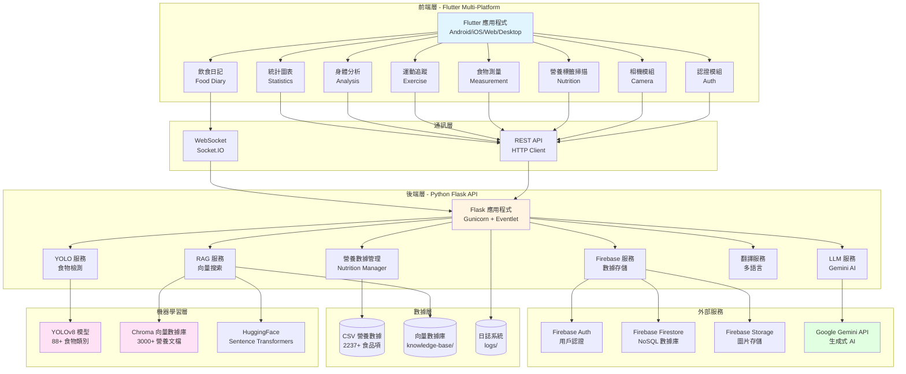
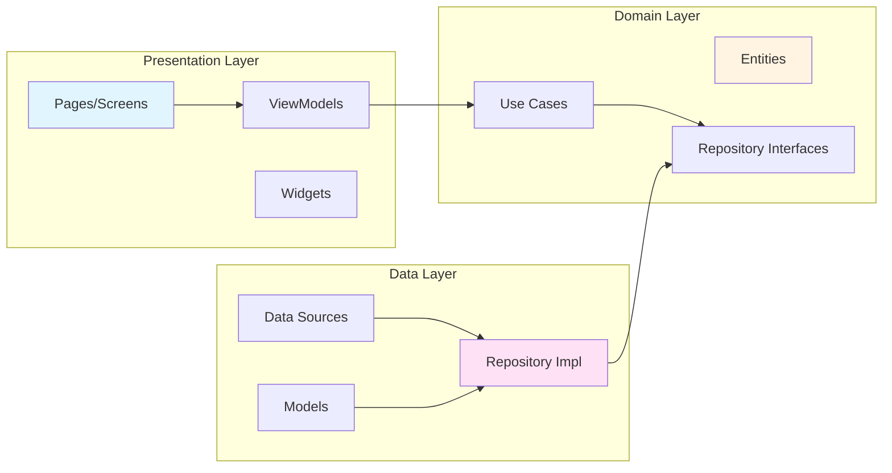
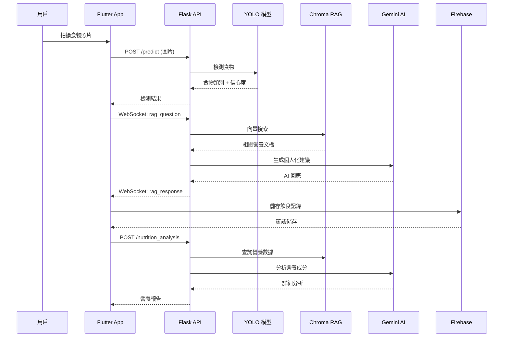
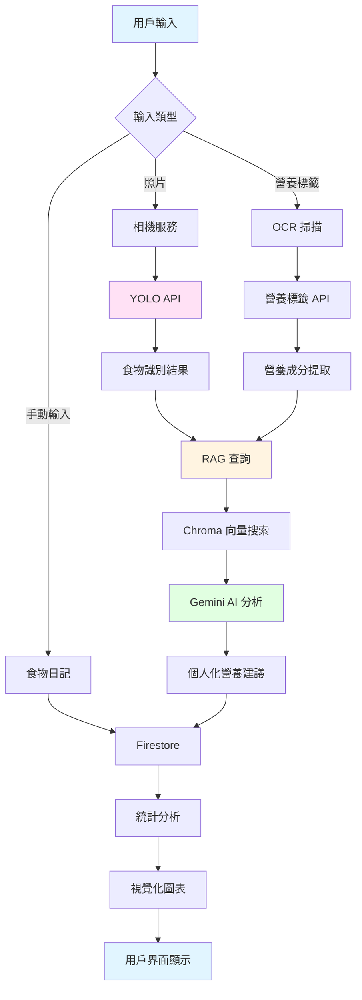
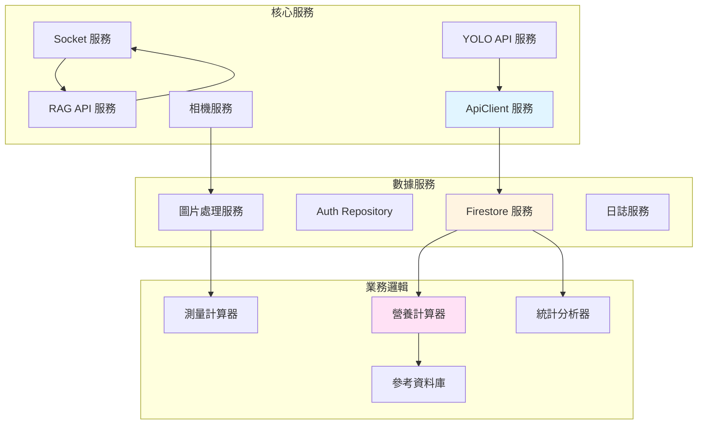
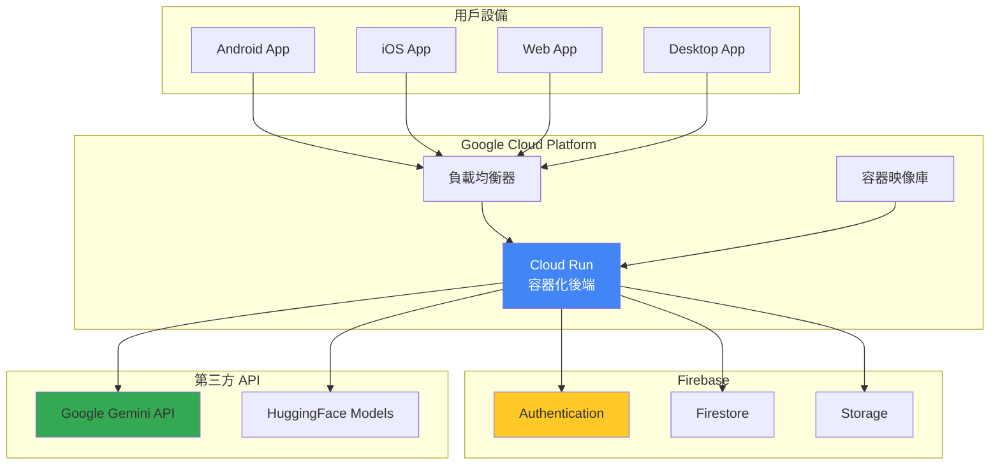

# 系統架構圖 - 健康與營養 AI 應用程序

## 整體系統架構



## 詳細架構層次

### 1. 前端架構 (Clean Architecture)



### 2. API 通訊流程



### 3. 資料流架構



### 4. 服務層架構



### 5. 後端服務架構

```mermaid
graph TB
    subgraph "Flask 路由層"
        R1[/health]
        R2[/predict]
        R3[/analyze_nutrition]
        R4[/rag_query]
        R5[/nutrition_analysis]
        R6[Socket.IO 事件]
    end

    subgraph "服務層"
        SV1[Firebase Service]
        SV2[RAG Service]
        SV3[LLM Provider]
        SV4[Nutrition Manager]
        SV5[Translation Service]
    end

    subgraph "模型層"
        M1[YOLO 模型載入器]
        M2[Chroma 向量引擎]
        M3[Embedding 模型]
    end

    R2 --> M1
    R3 --> SV3
    R4 --> SV2
    R5 --> SV2
    R6 --> SV2

    SV2 --> M2
    SV2 --> M3
    SV2 --> SV3
    SV3 --> E4[Gemini API]
    SV1 --> E1[Firebase]
    SV4 --> F1[(CSV Data)]

    style R1 fill:#e1f5ff
    style SV2 fill:#fff4e1
    style M1 fill:#ffe1f5
```

### 6. 部署架構



## 技術堆疊總覽

### 前端 (Flutter)
- **框架**: Flutter 3.5.3+
- **狀態管理**: Provider 6.1.2
- **路由**: Go Router 15.1.2
- **即時通訊**: Socket.IO 3.1.2
- **Firebase**: Auth, Firestore, Storage
- **圖表**: fl_chart 0.69.0
- **UI**: Material Design

### 後端 (Python)
- **框架**: Flask 3.0.0
- **伺服器**: Gunicorn 21.2.0, Eventlet 0.35.1
- **機器學習**: YOLOv8, OpenCV, Pillow
- **RAG**: Langchain, Chroma, Sentence-transformers
- **AI**: Google Generativeai
- **數據庫**: Firebase Admin
- **WebSocket**: python-socketio

### 基礎設施
- **容器化**: Docker
- **部署**: GCP Cloud Run
- **CI/CD**: 自動化部署
- **監控**: 日誌輪替 + 健康檢查

## API 端點總覽

| 端點 | 方法 | 功能 | 輸入 | 輸出 |
|------|------|------|------|------|
| `/health` | GET | 健康檢查 | - | 服務狀態 |
| `/predict` | POST | 食物檢測 | 圖片 | 食物類別 + 信心度 |
| `/analyze_nutrition` | POST | 營養分析 | 食物數據 + 用戶資料 | 個人化建議 |
| `/rag_query` | POST | RAG 查詢 | 問題 + 用戶資料 | AI 回答 |
| `/nutrition_analysis` | POST | 詳細分析 | 食物列表 | 完整營養報告 |

## Socket.IO 事件

| 事件名稱 | 方向 | 功能 |
|----------|------|------|
| `rag_question` | 客戶端 → 伺服器 | 發送 RAG 查詢 |
| `rag_response` | 伺服器 → 客戶端 | 接收 AI 回應 |
| `nutrition_data` | 客戶端 → 伺服器 | 發送營養數據 |
| `nutrition_received` | 伺服器 → 客戶端 | 確認接收 |
| `connect` | 雙向 | 建立連接 |
| `disconnect` | 雙向 | 斷開連接 |

## 資料模型

### 前端模型
- **BodyMetrics**: 身高、體重、心率、血壓、睡眠
- **FoodEntry**: 名稱、餐次、卡路里、圖片、份量
- **NutrientData**: 蛋白質、碳水化合物、脂肪、維生素、礦物質
- **AIPrediction**: 食物類別、信心分數
- **AIAnalysisResult**: 預測、建議、營養資訊

### 後端模型
- **Nutrition Data**: 食品名稱、卡路里、營養素
- **User Profile**: 身高、體重、飲食偏好
- **Meal Record**: 食物、時間戳、圖片、分析
- **RAG Document**: 食物資訊、製作方法、益處

## 安全性考量

1. **認證**: Firebase Auth (Email/Password + Google OAuth)
2. **HTTPS**: 所有通訊加密
3. **環境變數**: 敏感資訊隔離 (.env)
4. **Firestore 規則**: 用戶資料隔離
5. **API 限流**: LLM 提供者故障轉移
6. **錯誤處理**: 優雅降級機制
7. **日誌**: 全面記錄，敏感資訊遮蔽

## 擴展性設計

1. **容器化**: Docker 容器易於水平擴展
2. **無狀態**: Flask API 無狀態設計
3. **雲端部署**: GCP Cloud Run 自動擴展
4. **快取**: HuggingFace 模型本地快取
5. **向量數據庫**: Chroma 持久化存儲
6. **異步處理**: Socket.IO 非阻塞通訊

## 監控與日誌

- **應用日誌**: 每日輪替，10MB/檔案，保留 5 份
- **健康檢查**: `/health` 端點監控服務狀態
- **錯誤追蹤**: Try-catch 全覆蓋
- **性能監控**: API 回應時間記錄
- **用戶行為**: Firebase Analytics 整合準備

---

## 系統特色

✅ **多平台支援**: 6 個平台 (Android, iOS, Web, macOS, Linux, Windows)
✅ **AI 驅動**: YOLO 食物識別 + RAG 個人化建議
✅ **即時通訊**: Socket.IO WebSocket 雙向通訊
✅ **Clean Architecture**: 分層架構，易於維護
✅ **雲端部署**: GCP Cloud Run 生產環境
✅ **完整功能**: 飲食追蹤、運動記錄、身體分析、統計圖表

**生產環境**: https://nutrition-api-459965557703.asia-east1.run.app
