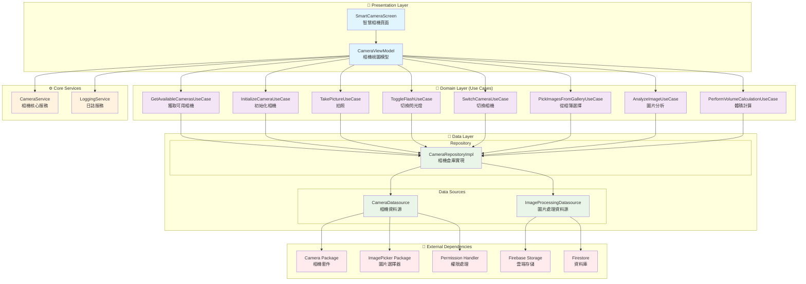
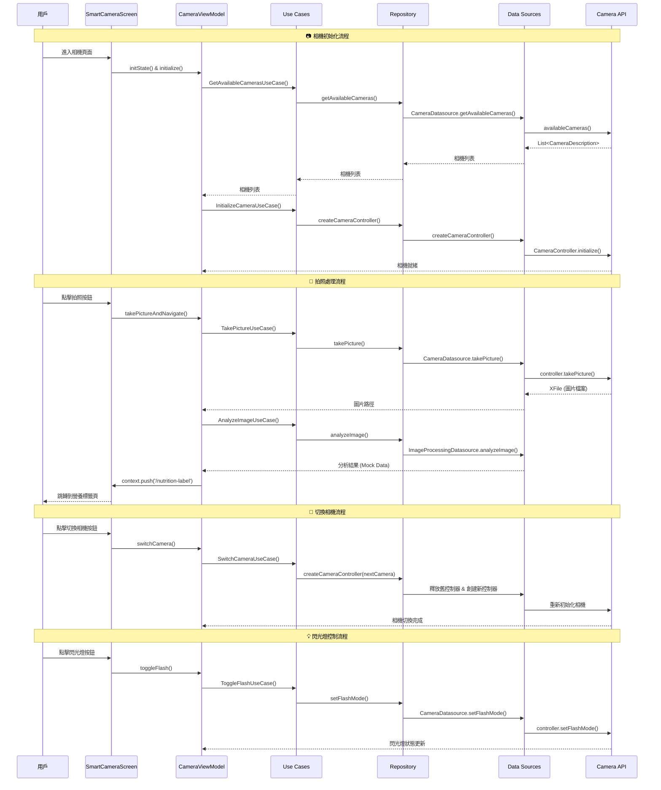
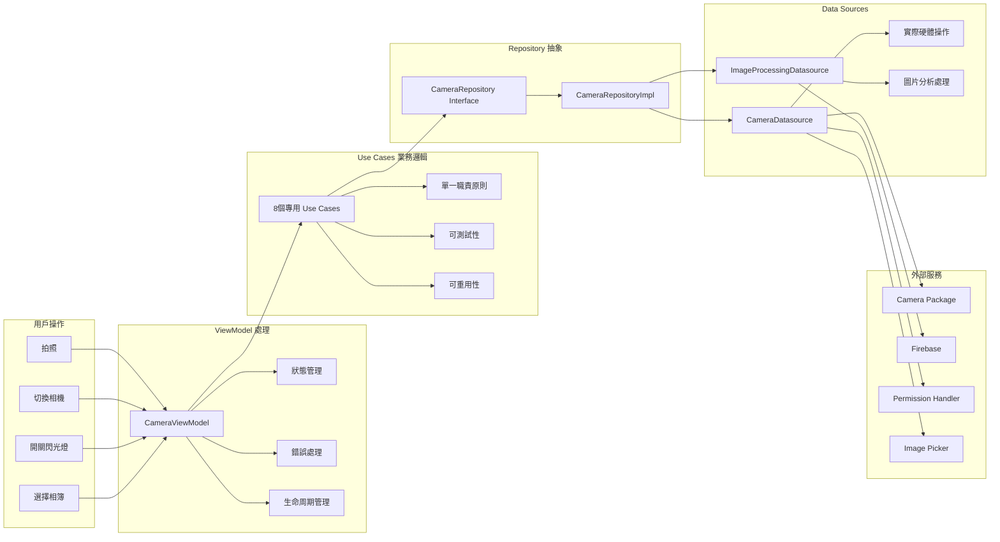

# 📸 相機頁面系統架構圖

## 🏗️ 整體架構概覽

## 🔄 相機功能流程圖

## 📊 資料流架構

## 🎯 設計模式說明

### 1. **Clean Architecture (清潔架構)**
- **Presentation Layer**: UI 和 ViewModel
- **Domain Layer**: Use Cases 和 Business Logic
- **Data Layer**: Repositories 和 Data Sources

### 2. **MVVM Pattern (模型-視圖-視圖模型)**
- **View**: SmartCameraScreen
- **ViewModel**: CameraViewModel
- **Model**: Use Cases + Repository

### 3. **Repository Pattern (倉庫模式)**
- 抽象資料存取邏輯
- 統一資料來源接口

### 4. **Use Case Pattern (用例模式)**
- 每個業務功能獨立封裝
- 單一職責原則

### 5. **Dependency Injection (依賴注入)**
- Provider 模式提供依賴
- 構造函數注入

## 🔧 技術特點

### ✅ **優點**
1. **模組化設計** - 各層職責清晰
2. **可測試性** - 每層都可獨立測試
3. **可維護性** - 易於修改和擴展
4. **可重用性** - Use Cases 可在其他頁面重用
5. **錯誤隔離** - 錯誤處理集中在各層邊界

### 📝 **核心組件說明**

#### **CameraViewModel**
- 管理相機狀態 (isInitialized, isLoading, isFlashOn)
- 協調各個 Use Cases
- 處理 UI 狀態更新

#### **Use Cases**
- `GetAvailableCamerasUseCase`: 獲取設備可用相機
- `InitializeCameraUseCase`: 初始化相機控制器
- `TakePictureUseCase`: 執行拍照操作
- `AnalyzeImageUseCase`: 圖片分析處理

#### **Repository**
- `CameraRepositoryImpl`: 統一相機操作接口
- 協調不同的 Data Sources

#### **Data Sources**
- `CameraDatasource`: 硬體相機操作
- `ImageProcessingDatasource`: 圖片處理和分析

這個架構確保了代碼的可維護性、可測試性和可擴展性，遵循了 SOLID 原則和 Clean Architecture 設計模式。